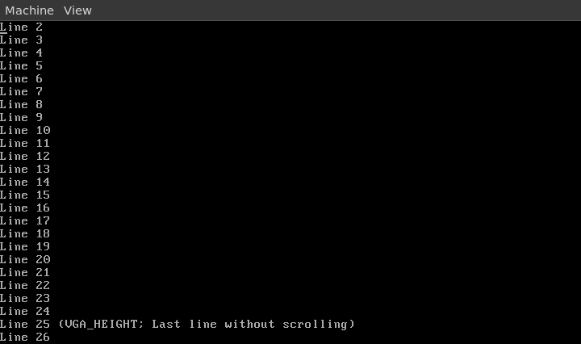

# IA-32 (i686) freestanding console
- Kernel init, kernel and VGA driver.
- Credits for tutorial and tasks: [wiki.osdev.org](https://wiki.osdev.org/Bare_Bones).
- The MIT license for the tutorial is in the root of the directory.

## NOTES:
- $ = shell command (assuming the use of bash && gnu coreutils).
- For windows users: use WSL with nixos and follow the nix instructions.
- You might have to bootstrap the cross-compiler (which can take some time).

## How to build with nix pacakge manager
1. Have nix(os) installed (supports Linux and Macos),
2. Download the repo:
  - `$ git clone https://github.com/c6rg0/Osdev.git`
  - `$ cd Osdev`
2. `$ nix build`

### Manually
1. Use the `flake.nix` to read the dependencies:
  - `nativeBuildInputs`: compile-time dependencies. `buildInputs`: run-time dependencies.
2. (still in the flake) Use the commands in all phases: 
  - They won't work to the dot since some directories are specific to nix.

## How to use the fresh iso
- On Linux, macOS and BSD, you can use qemu: `$ qemu-system-i386 -cdrom result/bin/kernel.iso`.
  - (if you done it the nix way) Using `$ nix develop` installs qemu for you.
- Or flash the iso on a USB and use it on hardware.

